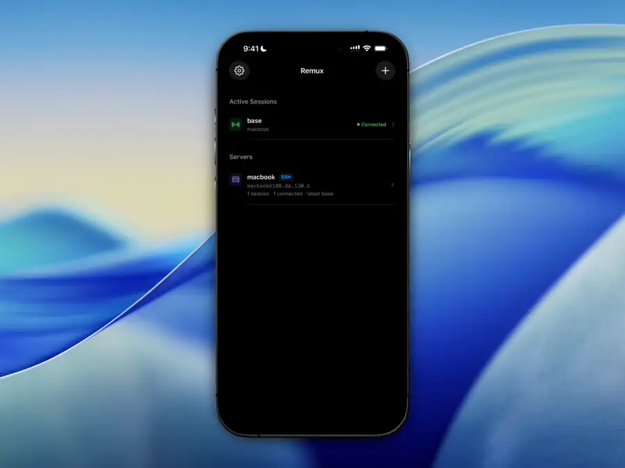

# Remux

<p align="center">
  
</p>

<p align="center">
  <a href="https://www.youtube.com/watch?v=WZXKzUdI6mQ">Watch demo on YouTube</a>
</p>

Remux is a native iOS client for remote tmux workspaces.

Remux brings tmux's session, window, and pane model into a native iPhone
interface. Connect to a server, open or create tmux sessions, swipe between
windows, open the pane picker as a bottom sheet, and split or close panes.

## What Works Today

- Save SSH servers and multiple tmux sessions per server
- Open existing tmux sessions or create new ones over SSH
- Keep multiple terminal sessions running and switch between them
- Render tmux windows and panes as native iOS-managed terminal surfaces
- Browse tmux windows and panes from native iOS controls
- Focus panes and route keyboard, paste, mouse, and scroll input to the
  focused pane
- Create and close tmux windows from the app
- Split and close tmux panes from the app
- Copy terminal selections and paste through the focused pane
- Store server passwords in Keychain
- Remember trusted SSH hosts
- Save terminal font and theme settings

## Current Limits

- This is early development work, not a daily-driver terminal yet.
- SSH is the only transport available today. Mosh support is planned.
- Source builds currently require a local GhosttyKit XCFramework at the
  path configured in [project.yml](project.yml). The framework is not
  distributed in this repository, so it must be available at that path before
  generating or building the project.

## Build from Source

Requirements:

- Xcode with iOS 18 SDK support
- XcodeGen
- the GhosttyKit XCFramework configured in [project.yml](project.yml)

Generate the Xcode project:

```bash
xcodegen generate
```

Build:

```bash
xcodebuild build \
  -project Remux.xcodeproj \
  -scheme Remux \
  -destination 'generic/platform=iOS Simulator'
```

Test:

```bash
xcodebuild test \
  -project Remux.xcodeproj \
  -scheme Remux \
  -destination 'platform=iOS Simulator,name=iPhone 17,OS=latest'
```

## Repository Layout

- [RemuxApp](RemuxApp): iOS app source
- [RemuxAppTests](RemuxAppTests): unit and integration-style tests
- [RemuxAppUITests](RemuxAppUITests): UI tests
- [docs](docs): project documentation
- [project.yml](project.yml): XcodeGen project definition

## Documentation

- [Overview](docs/overview.md)
- [Architecture](docs/architecture.md)
- [Development](docs/development.md)
